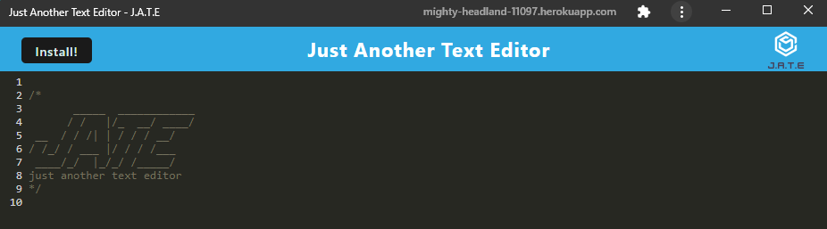

# Text-Editor
  
  ## Table Of Contents
  + [Description](#description)
  + [Installation Instructions](#installation-instructions)
  + [Usage Information](#usage-information)
  + [Contribution Guidelines](#contribution-guidelines)
  + [Questions](#questions)

  
  ---
  ## Description
  J.A.T.E., or Just Another Text Editor, is an installable web application that allows users to take notes with JavaScript syntax highlighting. 

  ## Installation Instructions
  Use the terminal command ```npm run install``` to install all dependencies and build the distributable folder. 
  Use the terminal command ```npm run start:dev``` to run the app on localhost:3000.
  
  ## Usage Information
  This repo may be cloned down and refactored for personal use.
  Once cloned, use the terminal command ```npm run install``` to install all dependencies and build the distributable folder. Then, use the terminal command ```npm run start:dev``` to run the app on localhost:3000.

  ---

  ## Contribution Guidelines
  Not accepting contributions at this time. 

  ## Questions
  If you have any questions, feel free to reach out to me with the following contact methods:

  GitHub: https://github.com/TDEvans97   Email: tylerdevansmusic@gmail.com

  Thank you for supporting this app,

  Tyler Evans
